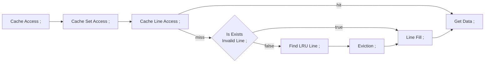
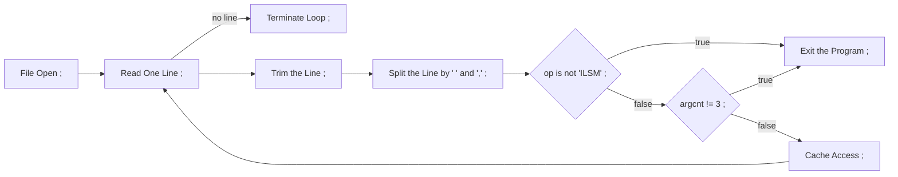
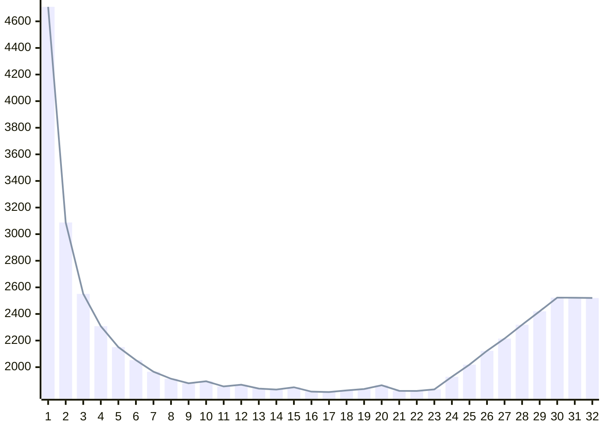
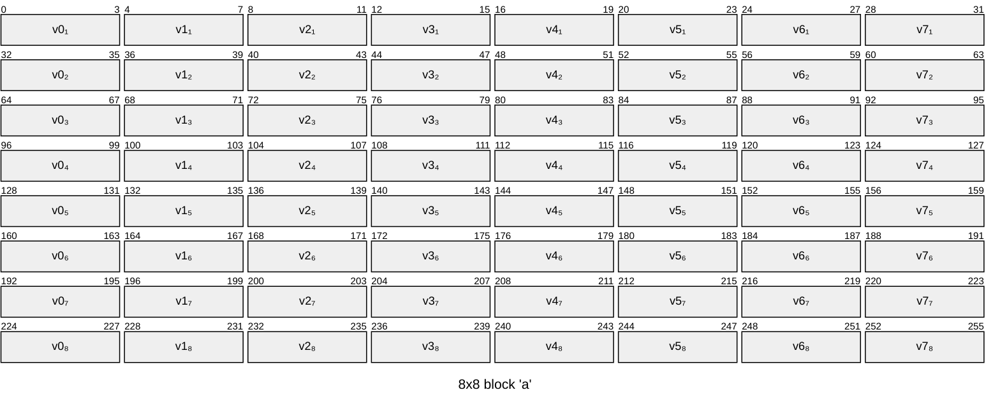
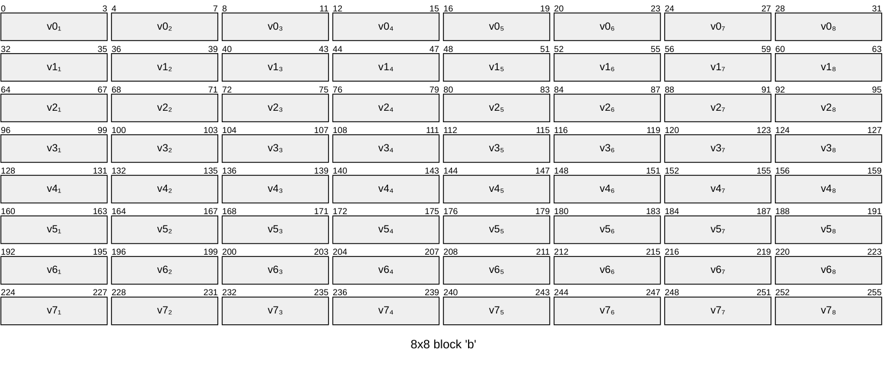
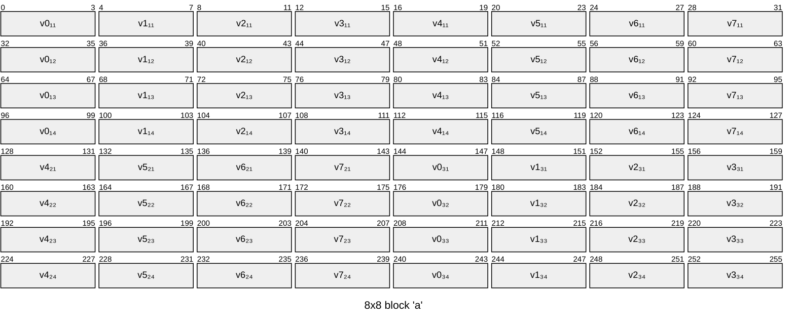
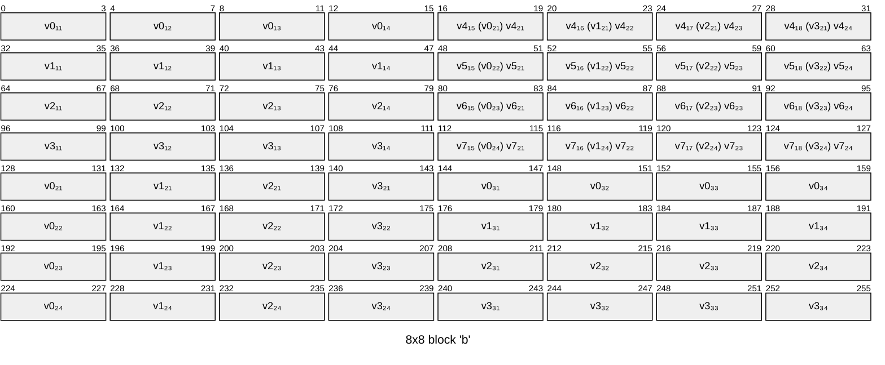

<style>
  html {
    font-family: Arial !important;
    font-size: 11pt !important;
  }
  p.linename {
    padding-left: 5px;
    padding-right: 5px;
    background-color: #E8E8E8;
    border-radius: 5px;
  }
  div.break {
    break-after: page;
  }
</style>

# Cache Lab

## Profile

- 학번: 20240614
- 이름: 이종원

## Part A

### 1. Cache Structure

```c
typedef unsigned long addr_t;

typedef struct {
    addr_t tag;
    int timestamp;
    bool valid;
} cache_line_t;

typedef cache_line_t* cache_set_t;
typedef cache_set_t* cache_t;
```

캐시의 한 라인을 valid, tag, timestamp의 정보를 가진다고 정의하였다. 이때 valid는 현재 라인에 유의미한 데이터가 저장되어 있는지, timestamp는 LRU를 위해 언제 이 데이터가 사용되었는지를 나타낸다. 이러한 라인들의 배열의 포인터를 set으로 정의하였고, set 배열의 포인터를 cache로 타입을 정의하였다.

```c
cache_t cache = malloc(S * sizeof(cache_set_t));
for (int i = 0; i < S; i++) {
    cache[i] = malloc(E * sizeof(cache_line_t));
    for (int j = 0; j < E; j++) {
        cache[i][j].valid = false;
        cache[i][j].tag = 0;
        cache[i][j].timestamp = lru_timestamp;
    }
}
```

입력 받은 s를 통해 S(=$2^s$)를 구하고 S와 cache set의 크기를 통해 힙 메모리를 할당한다. 이후 모든 cache set을 순회하며 입력 받은 E와 cache line의 크기를 통해 할당한 힙 메모리의 주소를 저장한다. 이후 line을 순회하며 초기값을 저장한다.

<div class='break'></div>

### 2. LRU(Least Recently Used) Policy Implementation

```c
int lru_timestamp = 0;

char *access(
    cache_t cache,
    addr_t set_index,
    addr_t tag
) {
    lru_timestamp++;
    ...
}
```

기본적으로 LRU를 구현하기 위해 timestamp를 사용하였다. 그 이유는 counter의 경우 한 번 캐시에 접근할 때마다 모든 값을 순회하며 올려야 하지만, timestamp의 경우에는 값은 변하지 않고 전역변수의 값만 올리면 되기 때문이다. timestamp의 경우 실제 시간보다는 접근할 때마다 1씩 값을 올리는 방식을 사용해서 효율적으로 구현하였다. 특정 캐시 라인에 접근하게 되면 해당 부분의 timestamp는 전역변수 lru_timestamp의 값을 가지게 된다.

```c
int lru_index = 0;
for (int i = 1; i < E; i++) {
    if (set[i].timestamp < set[lru_index].timestamp) {
        lru_index = i;
    }
}
```

eviction이 발생한 경우, 같은 set의 모든 line을 순회하며 가장 작은 timestamp를 가지는 라인을 골라 쫒아내고 지정된 데이터를 저장한다(고 시뮬레이션 한다).

### 3. Cache Access

캐시 시뮬레이션에서는 실제 데이터를 다루지 않고 단순히 캐시 라인에 대한 접근과 hit, miss, eviction만 계산한다. 따라서 고려해야하는 모든 operation L, S, M은 모두 같은 로직이다. 그것은 다음과 같다.



다만 M은 L + S로 처리되므로 이 로직을 두 번 처리해야한다.

<div class='break'></div>

### 4. Parsing Trace File

```c
#define ASSUMED_LINE_LENGTH 256

bool verbose = false;
int s = -1, E = -1, b = -1;
int hits = 0, misses = 0, evictions = 0;
```



```
 [operation] hex_addr,decimal_size
```

```c
char line[ASSUMED_LINE_LENGTH];
while (
    fgets(line, ASSUMED_LINE_LENGTH, fp) != NULL
) { ... }
```

trace file의 각 줄은 다음과 같은 format을 가진다. 이때 한 줄이 가질 수 있는 최대 크기를 어림해서 계산해보면, operation에 1 byte, hex_addr에 8 * 2 = 16 byte, decimal_size에 20 byte이기 때문에 약 40 byte이다. 따라서 이보다 큰 길이의 buffer를 주어 fgets 함수로 한 줄 씩 읽어올 수 있다.

```c
char *stripped_line = strip(line);
```

이후 strip 함수를 호출하여 문자열 양 끝의 space들을 제거한다. 로직은 lstrip의 경우 space의 개수만큼 포인터를 뒤로 미는 방식을 사용했고, rstrip의 경우에는 가장 처음 나타나는 오른쪽 끝의 space를 null로 덮어씌웠다.

```c
char *token = strtok(stripped_line, " ,");
while (token != NULL && cnt < 3) { ... }
```

strtok을 이용하여 순서대로 argument를 받아온 후 op, addr, size 변수에 각각 저장한다. 이후 op가 I, L, S, M인지, 모든 정보가 다 있는지 체크하고 만약 op가 I라면 그 줄은 생략한다. op가 L이나 S인 경우 access를 한 번, M인 경우 두 번을 호출해 각각의 반환값을 저장한 후 verbose가 설정된 경우 내용을 출력한다.

<div class='break'></div>

## Part B

### 1. 32x32 matrix

이 행렬은 한 줄에 총 4 * 32 = 128 바이트의 데이터가 있다. 즉, 8줄 이후에는 1024 바이트의 데이터로, `s=5, E=1, b=5`라는 조건에서 최대로 할당 가능한 캐시 사이즈이다. 따라서 이 크기의 행렬은 동시에 8줄 이상을 사용한다면 적어도 한 번은 충돌이 발생하게 된다.

예를 들어서 행렬 A의 주소가 0이라고 가정해보자. 이렇게 되면 A[0] = 0, A[1] = 128, ..., A[8] = 1024가 된다. 이때 cache set index의 계산 방식은 주어진 s, E, b에 따르면 (addr >> 5) & 31로 계산되기 때문에 1024는 0과 같이 0이라는 set index를 부여받는다. 그리고 set마다 line이 한 개 밖에 없기 때문에 같은 set이면 무조건 같은 line에 배정된다. 따라서 A[0]과 A[8]은 상호 배척 관계이다.

마찬가지로, 전체 크기가 4096 바이트이기 때문에 OS 환경마다 다르지만 행렬 B[0]이 A[0]과 같은 set index를 받을 확률이 높다. 따라서 A와 B의 경우 같은 index를 참조할 경우 상호 배척 관계가 될 확률이 높다.

32x32 행렬을 고려할 경우 이 같은 두 개의 충돌 가능성을 최소화하는 전략을 짜야 한다. 이때 활용할 수 있는 것이 바로 블로킹(blocking)이다. 블로킹의 경우에는 적절한 사이즈로 블록을 설정한다면 첫 번째 문제는 자연스럽게 해결된다. 왜냐하면 서로 겹치는 set index를 가지는 블록들은 서로 동시에 다뤄지지 않기 때문이다. 또한 적절히 조절한다면 두 번째 문제도 어느 정도 해결이 가능하다. 왜냐하면 A의 요소들을 한 번에 레지스터에 저장한 후 B에 다시 저장하게 되면 설령 B가 A를 eviction하더라도 문제가 없기 때문이다.

이때, 이 행렬에서는 8x8의 블록을 설정할 수 있다. 그 이유는 한 행렬에서 동시에 접근 가능한 행이 총 8개이기 때문이고, 한 개의 캐시 라인이 1 << 5바이트의 사이즈를 가지고, 이는 int로 따졌을 경우 8개의 요소이기 때문이기도 하다. 이 같은 환경에서 최적화를 한다면 다음과 같다.

1. 8x8 블록 a, b를 A와 B에서 정의한다.
2. `a[0][0:8]`를 모두 register에 저장한다. (miss `a[0]`)
3. `b[0:8][0]`에 register의 값을 저장한다. (miss `b[0:8]`)
4. `a[1][0:8]`을 모두 register에 저장한다. (miss `a[1]`)
5. `b[0:8][1]`에 register의 값을 저장한다. (possibly miss `b[1]` <- evicted by `a[1]`)

이런 식으로 반복하게 되면 한 블록 당 충돌 횟수를 대략 24번 내외로 줄일 수 있다. ([Appendix A 참고](#a-8x8-matrix-a-b-in-32x32))

<div class='break'></div>

### 2. 64x64 matrix

64x64의 경우에는 32x32보다 더욱 제한된 환경을 가진다. 왜냐하면 이 경우 한 줄이 총 256바이트의 크기를 가지기 때문에 A[0]와 A[4]는 반드시 충돌하게 되기 때문이다. 따라서 블록을 이전처럼 8x8으로 활용할 수 없다.

그렇다고 4x4로 만들게 되면 오히려 miss가 많아지게 된다. 그 이유는 여전히 캐시는 한 번에 8개의 int를 저장할 수 있고, 따라서 4x4로 하게 되면 저장된 캐시의 절반을 쓰고 다른 것이 저장되기 때문에 miss가 두 배로 늘어나게 된다.

또한 여전히 A와 B의 같은 index에서 충돌 가능성이 크다는 것은 유지된다. 따라서 이 경우에는 8x8 블록 내부에서 4x4 블록을 한 번 더 나누어서 사용해야 한다. 즉, 최적화는 다음과 같다.

1. 8x8 블록 a, b를 A와 B에서 정의한다.
2. 4x4 블록 a_tl(top left), a_tr(top right), a_bl(bottom left), a_br(bottom right), b_tl, b_tr, b_bl, b_br을 a, b,에서 정의한다.
3. `a_tl[0]`, `a_tr[0]`을 읽어 register에 저장한다. (miss `a_tl[0]`, also load `a_tr`)
4. `b_tl[0:4][0:4]`을 읽어 `a_tl[0]`의 값을 저장한 register의 값을 저장한다. (miss b_tl[0:4], also load `b_tr`)
5. `b_tr[0:4][0:4]`을 읽어 `a_tr[0]`의 값을 저장한 register의 값을 저장한다.
6. 반복한다. (miss `a_tl[1:4]`, possibly miss `b_tl[1:4]`)
7. `a_bl[0:4][0]`, `b_tr[0]`의 값을 register에 저장한다. (miss `a_bl[0:4]`)
8. `b_tr[0]`에 `a_bl[0:4][0]`의 값을 저장한 register의 값을 저장한다.
9. `b_bl[0]`에 `b_tr[0]`의 값을 저장한 register의 값을 저장한다. (miss `b_bl[0]`, possibly miss `a_bl[0]`)
  1. 이때 값은 `b_tr에` 저장될 때 이미 transpose된 상태이므로 그냥 저장해도 무방하다.
  2. 만약 8와 9의 순서가 바뀌면 `b_tr`이 eviction 될 수 있기 때문에 바꾸면 안 된다.
10. 반복한다. (miss `b_bl[1:4]`, possibly miss `a_bl[1:4]`)
11. 이후 `a_tl`, `b_tl` transpose와 같이 `a_br`, `b_br` transpose를 수행한다. (miss `a_br[0:4]`, `b_br[0:4]`, possibly miss `a_br[1:4]` again)

이 경우에 possibly miss는 a와 b가 diagonal에 위치한 블록인 경우(transpose를 해도 블럭의 위치가 바뀌지 않는 경우)이며, 최악의 상황에서도 대략 36번의 miss가 나게 된다. ([Appendix B 참고](#b-8x8-matrix-a-b-in-64x64))

<div class='break'></div>

### 3. 61x67 matrix

이 경우에는 위의 두 행렬처럼 align이 되는 행렬이 아니다. 둘 다 소수이기 때문에 그 sequence는 예측이 어렵고, 따라서 사실상 같은 행렬 내에서는 블록 단위로 겹치는 일은 없다.

물론 diagonal에 위치한 A, B의 블록은 여전히 겹칠 수도 있겠지만, 아까와 달리 행렬의 크기가 딱 떨어지지 않아 맞지 않을 확률도 높다.

따라서 이 경우에는 일반적인 transpose를 수행해주면 된다. 물론 여전히 블록 단위로 충돌하진 않지만 같은 행렬 내에서 충돌하긴 하기 떄문에 바로 transpose를 하면 안 되고 이것도 블록 단위로 나누어서 transpose를 해 줘야 한다. 다만 내부 알고리즘은 블록 단위 원소 transpose면 충분하다. 그 이유는 여전히 행렬의 서로 다른 줄이 충돌할 확률이 적기 때문이다.

1. 8x8 블록 a, b를 A와 B에서 정의한다.
2. 조건 하에서 `a[i][j]`를 `b[j][i]`에 할당한다. (miss `a[0:8]`, `b[0:8]`)

이 경우에서는 한 블록 내에서 충돌이 대략 16번 발생하며, 추가적인 충돌을 고려해도 대략 24번의 충돌이 발생한다.

다만 61x67의 경우에는 블록을 8x8로 제한할 필요는 없다. 이 역시 행과 블록 간의 충돌 가능성이 낮기 때문이다. 수학적으로 계산할 수는 있겠지만, 이 경우 무조건 블록의 크기는 32 이하여야 하기 때문에 직접 실험해서 측정할 수 있다.



실험 결과 블록 사이즈가 17일 때 가장 miss가 적게 발생했다. 따라서 이 행렬의 경우 17x17 블록을 사용하는 것이 가장 효과적일 것이다.

<div class='break'></div>

## References

[캐시가 동작하는 아주 구체적인 원리 (https://devsyw.tistory.com/14)](https://devsyw.tistory.com/14)

[[컴퓨터구조] 캐시 메모리 (https://velog.io/@letskuku/컴퓨터구조-캐시-메모리)](https://velog.io/@letskuku/컴퓨터구조-캐시-메모리)

<div class="break"></div>

## Appendix

### A. 8x8 matrix a, b in 32x32





<div class="break"></div>

### B. 8x8 matrix a, b in 64x64




