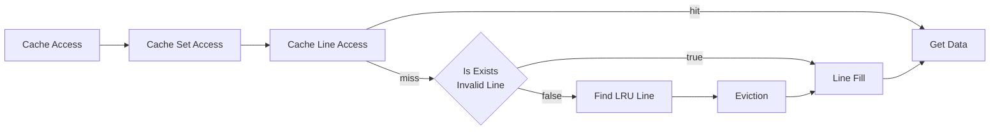
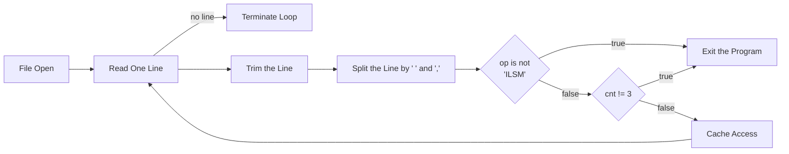

<style>
  html {
    font-family: Arial !important;
    font-size: 11pt !important;
  }
  p.linename {
    padding-left: 5px;
    padding-right: 5px;
    background-color: #E8E8E8;
    border-radius: 5px;
  }
</style>

# Cache Lab

## Profile

- 학번: 20240614
- 이름: 이종원

## Part A

### 1. Cache Structure

```c
typedef unsigned long addr_t;

typedef struct {
    addr_t tag;
    int timestamp;
    bool valid;
} cache_line_t;

typedef cache_line_t* cache_set_t;
typedef cache_set_t* cache_t;
```

캐시의 한 라인을 valid, tag, timestamp의 정보를 가진다고 정의하였다. 이때 valid는 현재 라인에 유의미한 데이터가 저장되어 있는지, timestamp는 LRU를 위해 언제 이 데이터가 사용되었는지를 나타낸다. 이러한 라인들의 배열의 포인터를 set으로 정의하였고, set 배열의 포인터를 cache로 타입을 정의하였다.

```c
cache_t cache = malloc(S * sizeof(cache_set_t));
for (int i = 0; i < S; i++) {
    cache[i] = malloc(E * sizeof(cache_line_t));
    for (int j = 0; j < E; j++) {
        cache[i][j].valid = false;
        cache[i][j].tag = 0;
        cache[i][j].timestamp = lru_timestamp;
    }
}
```

입력 받은 s를 통해 S(=$2^s$)를 구하고 S와 cache set의 크기를 통해 힙 메모리를 할당한다. 이후 모든 cache set을 순회하며 입력 받은 E와 cache line의 크기를 통해 할당한 힙 메모리의 주소를 저장한다. 이후 line을 순회하며 초기값을 저장한다.

### 2. LRU(Least Recently Used) Policy Implementation

```c
int lru_timestamp = 0;

char *access(
    cache_t cache,
    addr_t set_index,
    addr_t tag
) {
    lru_timestamp++;
    ...
}
```

기본적으로 LRU를 구현하기 위해 timestamp를 사용하였다. 그 이유는 counter의 경우 한 번 캐시에 접근할 때마다 모든 값을 순회하며 올려야 하지만, timestamp의 경우에는 값은 변하지 않고 전역변수의 값만 올리면 되기 떄문이다. timestamp의 경우 실제 시간보다는 접근할 때마다 1씩 값을 올리는 방식을 사용해서 효율적으로 구현하였다. 특정 캐시 라인에 접근하게 되면 해당 부분의 timestamp는 전역변수 lru_timestamp의 값을 가지게 된다.

```c
int lru_index = 0;
for (int i = 1; i < E; i++) {
    if (set[i].timestamp < set[lru_index].timestamp) {
        lru_index = i;
    }
}
```

eviction이 발생한 경우, 같은 set의 모든 line을 순회하며 가장 작은 timestamp를 가지는 라인을 골라 쫒아내고 지정된 데이터를 저장한다(고 시뮬레이션 한다).

### 3. Cache Access

캐시 시뮬레이션에서는 실제 데이터를 다루지 않고 단순히 캐시 라인에 대한 접근과 hit, miss, eviction만 계산한다. 따라서 고려해야하는 모든 operation L, S, M은 모두 같은 로직이다. 그것은 다음과 같다.



다만 M은 L + S로 처리되므로 이 로직을 두 번 처리해야한다.

### 4. Parsing Trace File

```c
#define ASSUMED_LINE_LENGTH 256

bool verbose = false;
int s = -1, E = -1, b = -1;
int hits = 0, misses = 0, evictions = 0;
```



```
 [operation] hex_addr,decimal_size
```

```c
char line[ASSUMED_LINE_LENGTH];
while (
    fgets(line, ASSUMED_LINE_LENGTH, fp) != NULL
) { ... }
```

trace file의 각 줄은 다음과 같은 format을 가진다. 이떄 한 줄이 가질 수 있는 최대 크기를 어림해서 계산해보면, operation에 1 byte, hex_addr에 8 * 2 = 16 byte, decimal_size에 20 byte이기 때문에 약 40 byte이다. 개행문자를 포함한다면 41 ~ 42byte까지 증가하며, 따라서 이보다 큰 길이의 buffer를 주어 fgets 함수로 한 줄 씩 읽어올 수 있다.

```c
char *stripped_line = strip(line);
```

이후 strip 함수를 호출하여 문자열 양 끝의 space들을 제거한다. 로직은 lstrip의 경우 space의 개수만큼 포인터를 뒤로 미는 방식을 사용했고, rstrip의 경우에는 가장 처음 나타나는 오른쪽 끝의 space를 null로 덮어씌웠다.

```c
char *token = strtok(stripped_line, " ,");
while (token != NULL && cnt < 3) { ... }
```

strtok을 이용하여 순서대로 argument를 받아온 후 op, addr, size 변수에 각각 저장한다. 이후 op가 I, L, S, M인지, 모든 정보가 다 있는지 체크하고 만약 op가 I라면 그 줄은 생략한다. op가 L이나 S인 경우 access를 한 번, M인 경우 두 번을 호출해 각각의 반환값을 저장한 후 verbose가 설정된 경우 내용을 출력한다.

