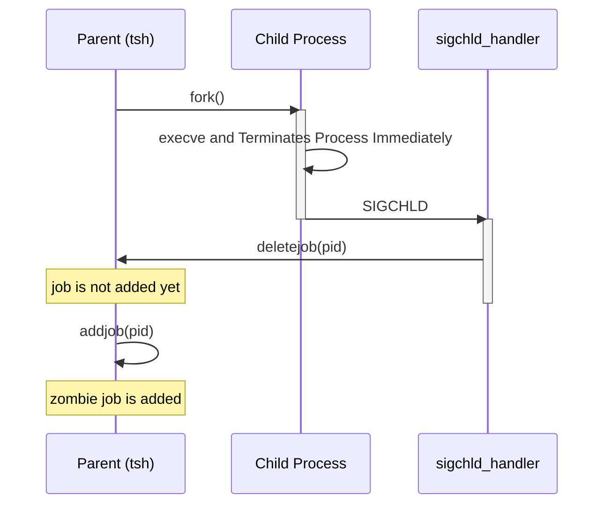
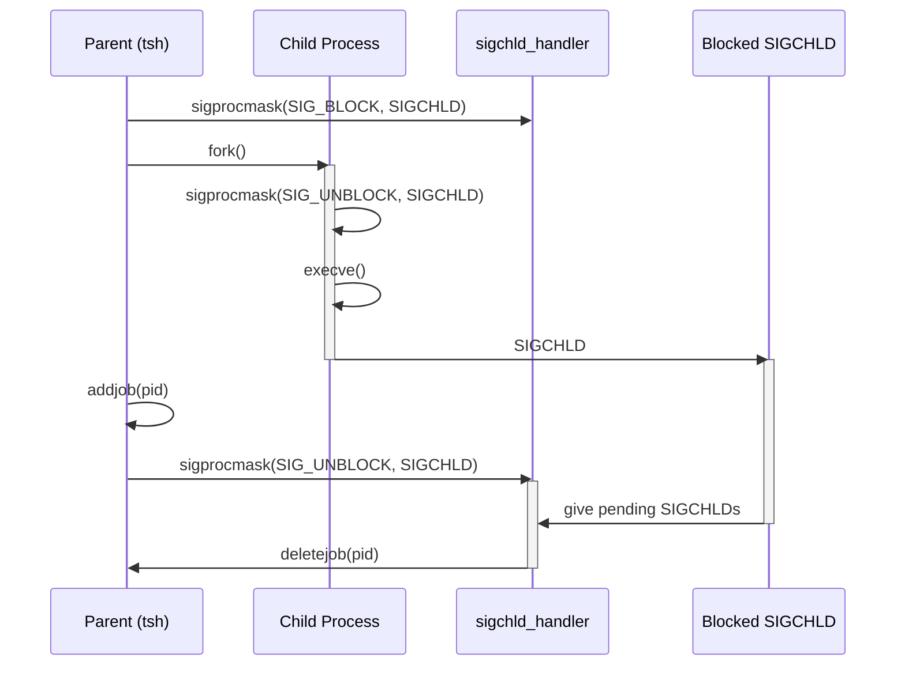
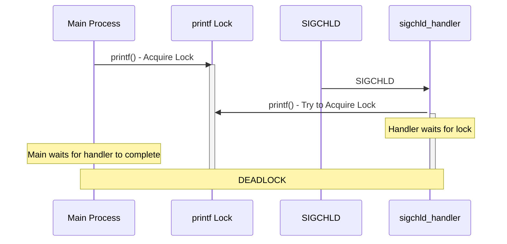

<style>
  html {
    font-family: Arial !important;
    font-size: 11pt !important;
  }
  div.break {
    break-after: page;
  }
</style>

# Shell Lab

## Profile

- 이름: 이종원
- 학번: 20240614

## 1. Function Logic

### 1-1. eval

1. parseline을 통한 cmdline 파싱
2. builtin_cmd 호출
3. builtin이 아니라면 execve 실행용 자식 프로세스 fork
    1. fork 전 sigchld 차단
    2. setpgid로 자식 프로세스와 tsh의 프로세스 그룹 분리
    3. fork 후 sigchld 차단 해제 후 execve 호출 (child 쪽)
        1. execve 실패 시 exit 호출
    4. fork 후 addjob 후 sigchld 차단 해제 (parent 쪽)
4. bg인지 검사해 fg면 waitfg 호출, 아니라면 jobid/PID 출력

### 1-2. buildin_cmd

1. `argv[0]`을 통해 cmd 파싱
2. quit이면 exit
3. jobs면 listjobs 호출
3. bg나 fg면 do_bgfg 호출

### 1-3. do_bgfg

1. 받은 cmd와 id validity 검증
2. jobid/PID로 파싱 후 getjobjid/getjobpid 호출
3. 해당 pid로 kill(-pid, SIGCONT)을 호출 해 프로세스 그룹 종료 후 job state FG/BG로 변경
4. 명령어가 bg라면 jobid/PID 출력, fg라면 waitfg 호출

### 1-4. waitfg

1. fgpid를 통해 pid와 같은지 busy loop evaluation
2. usleep 호출

### 1-5. sigint_handler/sigtstp_handler

1. errno 백업
2. 현재 fg pid를 통해 kill 호출

<div class="break"></div>

### 1-6. sigchld_handler

1. errno 백업
2. waitpid를 통해 `WUNTRACED | WNOHANG`의 경우 wstatus와 함께 호출
3. wstatus를 통해 sigint/sigtstp 및 normal exit 구분
    1. normal exit인 경우 deletejob
    2. sigint인 경우 terminating 메시지 출력 및 deletejob
    3. sigtstp인 경우 stop 메시지 출력, deletejob 및 job state ST로 변경
4. 모든 sigchld signal 해결할 때까지 루프로 반복

## 2. Issue

### 2-1. Race Condition

eval에서 현재 프로세스(tsh)와 자식 프로세스(cmd)를 fork로 독립 프로세스로 분리할 때 sigchld에 대한 race condition이 발생할 수 있다.

#### Without SIGCHLD Blocking



#### With SIGCHLD Blocking



이 같은 상황을 방지하기 위해 sigprocmask를 통한 명시적인 signal 관리를 추가하였다.

### 2-2. Handler Safety

Handler는 Asynchronous하다. 따라서 handler는 가급적 간단하게, Async Signal Safety한 함수들만 사용하여야 한다.

#### 1. Nested Signal Handlers

CPU의 스케쥴링에 따라서 handler들은 비동기적으로 실행된다. 이때 다수의 handler에서 동일한 전역변수에 접근하게 되면 Race Condition 및 Data Corruption이 발생할 수 있다. 따라서 전역변수에 접근하는 것은 최대 한 개의 handler에서만 허용된다.

이 같은 정책을 기반으로, `sigchld_handler`에게 전역변수 jobs 관리를 위임하였다. 이유는 sigchld가 각 job을 관리하는 가장 직접적인 handler이며, 동시에 각 child가 종료/중지되었다는 것이 handler 실행 시 보장할 수 있는 사실이기 때문이다. 이에 따라 sigint나 sigtstp의 경우 단순한 kill 메시지만 보내도록 설정하였다.

마찬가지로 errno도 handler가 덮어씌울 수 있으므로, handler 실행 시 백업을 해 놓았다가 return 직전 복구하는 식으로 코드를 짰다.

<div class="break"></div>

#### 2. Async Signal Safety



현재 `tsh.c`의 sigchld_handler에서는 printf 함수를 사용한다. 그러나 엄밀히 따지면 printf는 Async Signal Safety 함수가 아니므로 handler에서는 사용하면 안 된다. 그 이유는 printf가 내부적으로 Lock을 잡아서 함수 실행 중에는 다른 곳에서 비동기적으로 printf가 사용되더라도 현재 출력이 모두 출력되고 나서 다음 printf가 실행될 수 있게 안정적으로 동작하도록 짜여있기 때문이다. 하지만 이 특징이 곧 Deadlock을 만든다.

그래서 handler에서는 Async Signal Safety한 출력 함수인 `write`를 사용하는 것이 옳다. 또는 제공되는 Safety I/O Library(SIO)가 있다면 그것을 사용해야만 한다.

### 2-3. others

#### 1. execve Failure

```c
if (execve(argv[0], argv, environ) < 0) {
  printf("%s: Command not found\n", argv[0]);
  exit(0);
}
```

execve는 실행 실패 시 그 이후 코드를 이어간다. 자식이 부모 코드를 실행할 수도 있기 때문에 execve가 실패한다면 exit을 명시적으로 호출해 fork한 자식 프로세스를 종료해야 한다.

#### 2. Busy Loop

sleep(1)은 간단하지만 UX에 큰 영향을 준다. usleep(5000)으로 어느 정도 작게 sleep한다.

만약 Busy Loop가 아니라 실제로 지원되는 중단 함수인 sigsuspend를 사용한다면 비용을 거의 소모하지 않으면서 대기할 수 있다. pause의 경우 condition check와 pause 실행 사이에 handler가 실행되어 발생하는 race condition 문제가 있어 사용할 수 없다. 다만 본 구현에서는 busy loop를 권장하였기 때문에 관리가 복잡한 sigsuspend 대신 usleep을 사용하였다.

## Reference

[SP - 1.6 Details of Signal Handling](https://velog.io/@junttang/SP-1.6-시그널-핸들링Signal-Handling)

[21 시그널 처리](http://www.lug.or.kr/files/docs/GNU_C_Library/21.htm)

[sigsuspend 함수](https://m-falcon.tistory.com/51)

[csapp.c](https://csapp.cs.cmu.edu/3e/ics3/code/src/csapp.c)